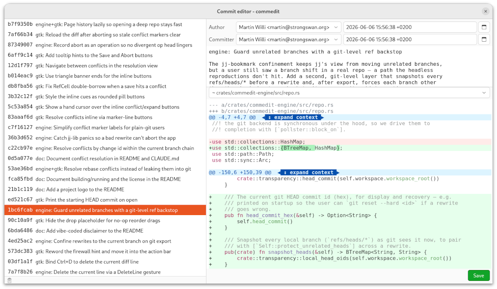

<p align="center">
  
</p>


comm(ed)it is a GTK4 desktop application for editing the history of a git
repository directly and visually — not just the latest commit, but any commit in
the graph. Browse the history like in `gitk`, pick a commit, edit it, and save:
comm(ed)it rewrites that commit in place and automatically rebases its
descendants. A one-line fix deep in the history is a couple of clicks rather than
an interactive-rebase session.

<p align="center">
  
</p>

## Features

- **Edit any commit in place** — change its message, its author/committer
  identity and dates, or the actual content of the files it changed. Saving
  rewrites the commit and rebases everything built on top of it.

- **Select several commits at once** — ctrl/shift-click to pick more than one. The
  right pane turns read-only and shows their *combined* diff as a single minimal
  patch (not stacked hunks), and a note when the changes overlap so they can't be
  combined. The author/committer fields show the shared value where the commits
  agree and a *(differs)* note where they don't — type a new name or date and
  **Save** writes it to every selected commit at once. You can also **drag the
  whole selection** as a group: drop it in a gap to move the selected commits
  together (keeping their order while the unselected commits in between stay put),
  onto another commit to fold them all in — always via the fixup / squash / amend
  picker, where *amend* takes the newest selected commit's message — or onto the
  trash to drop them all at once.

- **Structured diff editing** — file changes are an editable unified diff with a
  firewall that keeps the buffer a patch that still applies: typing on a context
  line splits it into a removed/added pair, deleting a removed line restores it,
  and `@@` headers stay read-only. It's syntax-highlighted per file type with
  changed words tinted inline, and each hunk has an *expand context* button in the
  gutter to reveal more of the surrounding file. A gutter shows old | new line
  numbers alongside the diff — the original number on removed lines, the resulting
  number on context and added lines.

- **Blame the old side** — click the slim handle at the left edge of the diff
  (a triangle, ▸, collapsed by default) to slide open a blame column annotating
  each context and removed line, in a gutter *left* of the line numbers, with the
  commit that last touched it in the *old* (pre-image) file. It's a true `git
  blame`-style walk, computed in-process via jujutsu's annotator and only while
  expanded (it's the one expensive view). It annotates a selected commit or the
  uncommitted working-copy diff alike. Hovering a hash highlights that commit's
  row in the history list, if it's shown; the hash reads as a hyperlink (pointer
  cursor plus underline), and clicking it opens that origin commit in the diff
  view (paging older history in when the origin sits below what's loaded). The
  hashes are drop targets too: drag a hunk onto one to squash it into that origin
  commit (the hash reddens while a valid drop hovers it).

- **Revert hunks or files** — every changed file carries a *revert* button in the
  gutter to drop its change from the commit, and every hunk of a modified file one
  to drop just that hunk. It works whatever the change is: a modified file reverts to its
  old content, a file the commit *added* is dropped entirely, and one it *removed*
  is restored. Reverting doesn't save on its own; you then **Save** to drop the
  changes or **Split** to peel them off.

- **Split one commit into two** — when the diff has pending edits, **Split**
  keeps your edited version *and* inserts a follow-up commit holding everything
  you changed away from the original, so the two together still reproduce the
  commit's result and its descendants are untouched. Paired with *revert*, that's
  how you carve a commit apart.

- **Reorder, drop and restore** — drag commits to reorder them in the history,
  drop one into the trash, or drag it back to restore it. Works anywhere in a
  merge graph: side-branch commits move, trash and restore like mainline ones
  (merges keep their shape; the merge commit itself stays put). Where several
  ancestry lines cross the drop gap, a small picker of colored lines asks which
  one to splice into. A trashed commit also offers a hover button (a down arrow)
  that drops it out of the trash and writes its changes back to the working tree
  as **uncommitted** edits — the "uncommit" you'd reach for `git reset --mixed`.

- **Squash by dragging** — drag a commit *onto* another to fold it in. A commit
  with an autosquash prefix (`fixup!` / `squash!` / `amend!`) highlights its
  matching target while you drag and folds in on drop; an ordinary commit opens a
  small fixup / squash / amend picker. While dragging *any* single commit, if
  every line it removes blames back to one single commit, that commit is
  highlighted in purple — a content-derived "this is where it belongs", stronger
  than the subject match.

- **Relocate a single hunk** — grab a hunk by its `@@` header line in the diff
  (the line lights up and shows a grab cursor) and drop it onto any commit row, or
  onto the working-copy `@` row, to move just that hunk there — the "this diff
  belongs in a different commit" fixup at hunk granularity. You can also drop it
  onto a hash in the blame column to send it straight into that origin commit,
  without hunting for the row in the history list. Grabbing a hunk pre-highlights
  the commit it would naturally absorb into (the one all its removed lines blame
  to) in purple, so you can see where it belongs before you drop — and the `@@`
  line annotates that same target in the blame gutter. Source and destination
  may each be a commit or the working copy: commit → commit folds it in, commit →
  `@` carves it back out as an uncommitted change, `@` → commit folds an
  uncommitted hunk into history. The rest of the diff stays put and descendants
  rebase. (Grabbing off a `@@` line is ordinary text selection, so the handle
  never gets in the way.)

- **Edit several branches as one DAG** — the header branch dropdown is a *set* of
  editable branches, not just a view filter. It starts at the branch you opened;
  tick another and it folds into one unified history graph as a real, rewritable
  lane (untick to drop it again — the last one stays). Every commit shown is then
  editable, on any branch, and editing a commit several branches share moves all of
  them (their bookmarks follow, their descendants rebase) — git-correct, the way a
  shared-ancestor amend should behave. Each branch's worktree, if it has one, is
  kept in sync.

- **Drag commits across branches** — with more than one branch in the DAG, drag a
  commit from one lane onto another's. Crossing a branch boundary pops a small
  **Copy / Move** chooser (the same family as the squash picker): **Move**
  reparents the commit onto the other branch (it leaves its old one, descendants
  rebase); **Copy** cherry-picks it (a re-applied copy, the original stays put).
  Drag a commit *onto* another branch's commit to **squash** it in across the
  boundary — a squash always consumes the source, so it just folds in. A
  same-branch reorder or squash is unchanged (no chooser). When several lanes cross
  the drop gap, the pick-a-line popover now labels each by branch name, so choosing
  the destination branch is a named choice rather than a colour guess.

- **Drag a commit between windows** — open the same repo in two windows (say one
  per branch) and drag a commit from one onto a gap in the other's history to
  **cherry-pick** it in. It's a copy: the source window keeps its commit, the
  target grows a re-applied one (descendants rebase, conflicts held back as
  usual). Both windows must be on the *same* repository — they share an object
  store; dragging between two different repos is refused. (In-window, the unified
  DAG above does the same copy *and* offers a move; the two-window drag remains the
  way to copy a commit you don't want to fold a whole branch in to see.)

- **Revert a commit in place** — hover a commit's row in the history list and a
  revert button appears at its right edge (aligned down the list); clicking it
  drops a `Revert "…"` commit directly on top of that commit, neutralizing its
  change while keeping both in history (its descendants rebase onto the revert).
  Unlike dropping a commit into the trash, the original stays and the undo is
  recorded explicitly.

- **Merge a commit out** — beside the revert button, a right-arrow button
  introduces a new merge commit just above the hovered commit: the commit becomes
  a one-commit side branch that the merge folds back into the mainline, with a
  pro-forma message to reword later. It's a way to *add* a merge — turning linear
  history into a branchy one to organize it — rather than just edit around the
  merges you already have. Once the merge is there, reorder commits onto its side
  branch to group them under it. The content is untouched (the merge introduces no
  change of its own) and the commit's descendants rebase straight onto it.

- **Conflicts never reach your git history** — a reorder, drop or squash is a
  real rebase, so it can conflict. Spurious conflicts (nearby but independent
  edits) are resolved for you automatically; a genuine one is held back — `git`
  keeps seeing your original, untouched history — and shown right in the diff pane
  with standard git conflict markers, a *keep ours / both / theirs* button in the
  gutter of each marker line, and an ours | theirs line-number gutter. Resolve
  them file by file; the rewrite reaches git only once the last is cleared, or you
  abort and leave history exactly as it was.

- **Uncommitted changes are first-class** — whatever you've edited or added on
  disk but not committed appears as a **hollow node on its branch's lane** in the
  history, with the same editable diff. With the message left empty, **Save**
  writes your diff edits back to the working tree; type a commit message and
  **Save** instead commits the changes on top of that branch's tip
  (author/committer default to your git identity unless you set them). Fold it
  into an existing commit, **Split** off a piece, or drop it onto the trash to
  discard it — and until you commit it, it rides through every rewrite untouched,
  still uncommitted when you're done. Every branch you're editing that is checked
  out in a worktree shows its own hollow node, so you can tidy several worktrees'
  uncommitted work from one window — Split and per-piece Save work on any of those
  nodes, not just the checked-out launch worktree's.

- **Review before you're done** — the toolbar's **Review** toggle flips the
  window into a read-only, full-window diff of every content change you've made
  this session: the repository now versus how it was when you opened it.

- **Travel through your edits** — the toolbar's **Edit history** button (the
  clock icon) opens a dropdown of every change you've made this session, newest
  first, with a marker on where you are now. Click any entry to roll the
  repository — commits, branch and working tree — back, or forward, to that
  snapshot; hovering one highlights the commit rows it touched. The bottom
  **Session start** entry undoes the whole session at once.

- **Search the history** — the search box beside the Reload button (focus it with
  `Ctrl+F`) matches what you type against the commit subjects, highlighting the
  matched characters in the list and scrolling to the first hit as you go. It's a
  plain substring search like `git log --grep`: type several words and each must
  appear (in any order), so `fix login` finds "Login: fix the redirect". Press
  `Enter` to select that commit, and `Enter` again to step to the next match.

- **Spot off-style commit summaries** — comm(ed)it learns the conventions your repo
  *already* follows from its own history — whether subjects carry a `type:` prefix
  (and how it's cased), capitalize the summary, avoid a trailing period, how long they
  run — and marks any
  commit whose summary drifts from that norm with a small 🤔 in the list (its tooltip
  says what's off). It never imposes a house style: a repo with no clear convention,
  or too little history to tell, gets no marks at all. Click the marker to fix the
  mechanical slips in place (capitalization, a stray period) — or, when only judgment
  calls remain (a missing prefix, an over-long summary), to jump to the message and
  edit it yourself.

- **Spell-check the message as you type** — the commit-message editor underlines
  misspelled words; right-click one for correction suggestions or to add it to your
  dictionary. It uses your system's spell checker (GNOME libspelling over enchant),
  so it picks up whichever dictionaries you already have installed.

## Keyboard shortcuts

- `Ctrl+F` — focus the commit search box; `Enter` jumps to the next match.
- `Ctrl+S` — save the current edits, rewriting the selected commit in place.
- `Ctrl+D` — in the diff pane, delete the line(s) under the selection (drops
  `+` additions, restores `-` removals to context).
- `Alt+↑` / `Alt+↓` — in the diff pane, move the current `+` line (or a selected
  block of them) up or down, sliding it over context and `-` lines to reorder the
  added content.
- `Ctrl+Z` / `Ctrl+Y` — in the diff pane, undo and redo your edits.
- `Ctrl+Q` — close the window.

## Installing a binary release

Pre-built binaries for Linux (x86-64 and AArch64) and macOS (Apple Silicon) are
attached to each [GitHub release](../../releases). They are **dynamically linked** against
your system GTK, so they are not self-contained — you need a few runtime
dependencies installed first:

- **`git`** on your `PATH` — comm(ed)it drives the git CLI for working-copy and
  `HEAD` bookkeeping.
- **GTK 4** (≥ 4.10) and **GtkSourceView 5** (≥ 5.4) shared libraries.
- **libspelling** (GTK 4 spell-check library) for the message-field spell checker.
  It checks against your system's enchant dictionaries, so also install a dictionary
  for your language (e.g. `hunspell-en-us` or `aspell-en`) if you don't have one.

Install the dependencies, then unpack the tarball and run it:

```sh
# macOS (Apple Silicon)
brew install git gtk4 gtksourceview5 libspelling
tar -xzf commedit-macos-aarch64.tar.gz
xattr -dr com.apple.quarantine commedit   # the binary is unsigned; clear Gatekeeper
./commedit /path/to/repo

# Debian / Ubuntu (24.04+; 22.04 ships GTK 4.6, too old)
sudo apt install git libgtk-4-1 libgtksourceview-5-0 libspelling-1-2
tar -xzf commedit-linux-x86_64.tar.gz   # or commedit-linux-aarch64.tar.gz on ARM64
./commedit /path/to/repo
```

The runtime library packages on other common distributions:

| Distribution    | Install command                                                      |
| --------------- | -------------------------------------------------------------------- |
| Fedora          | `sudo dnf install git gtk4 gtksourceview5 libspelling`               |
| Arch Linux      | `sudo pacman -S git gtk4 gtksourceview5 libspelling`                 |
| openSUSE        | `sudo zypper install git libgtk-4-1 libgtksourceview-5-0 libspelling-1-2` |

Drop the `commedit` binary somewhere on your `PATH` (e.g. `~/.local/bin` or
`/usr/local/bin`) to launch it from anywhere. There is no Windows release.

## Building and running

comm(ed)it is a Rust workspace; you need a Rust toolchain, `git` on your `PATH`,
and the system GTK4, libsourceview5 and libspelling **development** libraries (e.g.
`libgtk-4-dev`, `libgtksourceview-5-dev` and `libspelling-1-dev` on Debian/Ubuntu, or
`gtk4-devel`, `gtksourceview5-devel` and `libspelling-devel` on Fedora).

```sh
cargo build                 # build the workspace
cargo test                  # run the engine and integration tests
cargo run -p commedit-gtk -- /path/to/repo  # launch the app against a repo (defaults to ".")
cargo run -p commedit-gtk -- /path/to/repo feature  # edit a branch you haven't checked out
```

## Use from AI agents (Claude Code plugin)

The same engine is exposed to AI agents through a [Claude Code
plugin](https://code.claude.com/docs/en/plugins). With it installed, an agent
edits history the way the GTK app does — and then some: edit any commit's
message, identity or file contents; split, reorder, drop, restore or squash
commits; create, revert or cherry-pick commits and introduce merges; and fold
uncommitted changes in or commit them — addressing commits by sha or jj's stable
change id, with descendants rebased automatically, conflicted rewrites held back
from git until they resolve — file by file, reading just the conflict hunks (or
the whole file on request) and writing back a targeted patch against the
conflict markers or the whole resolved file — or abort, and every step undoable.
Alongside the tools the plugin ships skills that teach the agent *when* to reach
for these workflows and a `commedit-operator` subagent that drives them.

Finding where a stray fix belongs is a first-class step: `blame_squash_targets`
content-blames the lines a change touches and ranks the commits that own them —
the same old-side blame the diff column shows, turned into ready-to-squash
targets — so the agent can fold a fix into the commit that introduced the code
even without knowing which one that is. It complements `suggest_squash_targets`,
which instead routes an explicit `fixup!` / `squash!` / `amend!` subject prefix.
And `absorb_working_copy` takes that a step further: it routes *every*
uncommitted hunk to the commit that owns its lines and folds them all in one
rewrite (like `git absorb` / `jj absorb`), leaving ambiguous hunks in the working
copy — with a `dry_run` that returns the routing plan to preview first.

One server hosts several **independent editing sessions** over the one repository
it serves — one per branch — so an agent can edit several branches at once, and in
parallel. Every tool names the session it acts on by id (the branch's short name);
`list_sessions`, `open_session` and `close_session` manage them. A branch checked
out in a worktree opens worktree-bound there (with a live working copy); a branch
checked out nowhere opens off-worktree (only its ref moves). The launch branch is
just the first session.

The plugin is self-contained: each [GitHub release](../../releases) attaches
`commedit-plugin.zip`, which bundles a prebuilt server for every supported
target (Linux x86-64, Linux AArch64, macOS Apple Silicon) plus a launcher that
picks the right one — nothing to compile, and the only requirement is `git` on
your `PATH` (the GTK runtime libraries are needed only for the desktop app).

See [`plugin/README.md`](plugin/README.md) for the full list of what the agent
can do, the bundled skills and `commedit-operator` subagent, and how to install
the plugin.

## How it works

Under the hood, comm(ed)it is built on [jujutsu](https://github.com/jj-vcs/jj)
(`jj-lib`) for its rewrite-and-rebase engine: jj does the heavy lifting, but the
working copy and `git` itself see an ordinary, attached-HEAD git repository the
whole time. jj's own metadata — and every internal ref it would otherwise write —
is kept entirely out of your repository: it operates on a throwaway directory that
shares only your repo's object database and is discarded when you close the app,
so comm(ed)it never leaves a `.jj` directory or stray `refs/jj/*` behind, and
never disturbs a repo you already manage with jj.
By default it rewrites only the branch you opened; your other local branches and
tags stay exactly where they are (they simply diverge, as they would after a
`git commit --amend`). The header branch dropdown is an *editable set*: tick more
branches and they are imported as real bookmarks into one unified DAG, so a rewrite
that touches a commit several of them share moves every one (its bookmark rides the
rebase, its descendants follow) and a commit can be dragged or squashed from one
branch's lane onto another's. A branch you only see as an ancestor *pill* (a git
decoration, not a ticked entry) is left frozen, exactly as today. The code is split
into a headless `commedit-engine` crate (all repository logic, unit-tested against
scratch repos) and a `commedit-gtk` crate (the UI), so the rewrite logic carries no
GTK dependency.

You can also edit a branch you have **not** checked out: pass its name —
`commedit /path/to/repo <branch>`, or just `commedit <branch>` from inside the
repo (a lone argument is a path if it's an existing directory, otherwise a
branch). comm(ed)it then moves only that branch's ref and leaves `HEAD`, the
index and the working tree completely untouched. Every history edit works as
usual, but there is no working copy for the launch view (a branch you haven't
checked out has no uncommitted changes), so its working-copy features are
unavailable. A branch in the editable set that *is* checked out in another worktree
is kept in sync: its uncommitted changes appear as their own hollow node on its
lane — which you can fold into a commit, discard, edit, or commit, exactly like
the checked-out worktree's — and a rewrite that moves the branch re-materializes
that worktree's files and index (its own uncommitted changes ride along), so
editing it no longer desyncs the other checkout. A plain `git commit` you make in
that worktree out of band is absorbed onto its branch on the next operation,
rather than reappearing as a phantom uncommitted change. Its uncommitted changes
can be **split** into separate pieces and committed one at a time, exactly like
the checked-out worktree's; only the sub-hunk *partial-selection* commit (via the
MCP server) remains a launch-worktree capability.

Opening several windows on one repository — typically one per branch — lets you
drag a commit from one onto another to cherry-pick it across branches. The
windows are separate processes, so the drag travels as text; the receiving
window recognizes a commit from a sibling window of the *same* repository (they
share one object store, so the commit is already reachable) and re-applies it at
the drop gap, leaving the source branch untouched. Two windows on *different*
repositories can't exchange commits — their object stores never meet, so the drop
is refused with a note rather than half-done.

Opening a large history is fast after the first time. Building jj's commit index
means reading every commit reachable from `HEAD` — seconds on a huge repo (the
Linux kernel takes ~35s), and it would otherwise be rebuilt from scratch on every
launch. So comm(ed)it caches that index per-repository under
`$XDG_CACHE_HOME/commedit` (i.e. `~/.cache/commedit`) — **outside** your
repository, never in it — and on the next launch primes from it and indexes only
the commits added since, turning that ~35s open into ~1s. Several windows (or an
MCP agent) can share one repo's cache at once. The cache maintains itself: entries
unused for a month, or beyond a size cap, are evicted automatically, and it is
always safe to delete `~/.cache/commedit`. It only ever makes opening faster — if
an entry is ever stale or unreadable, comm(ed)it silently rebuilds from scratch.

That transparency is what keeps conflicts out of your history. While a rewrite is
conflicted, comm(ed)it moves no git ref, `HEAD` or working-tree file: the
conflicted commit objects sit unreachable in the object store and plain `git`
keeps seeing your original history, until the chain resolves clean (then it
exports in one step) or you abort (then nothing happened). A conflict that lands
on a *sibling* branch or a sibling worktree's uncommitted changes — not just the
launch branch's — is resolved in the diff pane the same way, since detection and
resolution both span every editable branch and every worktree. *Spurious* conflicts
— adjacent but independent edits that an ordinary 3-way merge can't place even
though the combined result is unambiguous — are reconstructed and resolved
automatically before any of that, so you only ever face conflicts that genuinely
need a decision. Some conflicts are structural (a directory, symlink or submodule
rather than text) and can't be resolved in the diff pane; for those, aborting the
rewrite is the only way out.

Your uncommitted changes ride through every rewrite because jj keeps them in its
working-copy commit and rebases them forward like any other descendant. The one
thing the jj model can't see is content that lives *only* in the git index — a
file you `git add`ed and then changed or removed on disk — so before each rewrite
resets the index, comm(ed)it pins the whole index to a
`refs/commedit/backup/index-*` ref. The same protection applies to every worktree
it re-materializes: a sibling worktree's index is backed up before its reset too,
under a per-worktree-keyed ref so the recovery points don't evict one another.
These are silent, transient safety nets: only the most recent one per worktree is
kept (older ones are pruned automatically on the next rewrite), and you almost
never need them. If you do, recover with
`git read-tree <ref>` (restage) or `git checkout <ref> -- .` (write to disk);
`git for-each-ref refs/commedit/backup/` lists any that exist.

## Disclaimer

This project has been completely vibe-coded. It rewrites git history, and it may
eat your commits and your git repository. Use it only on repositories you can
afford to lose, and keep a backup.

As a recovery anchor, the toolbar's **Edit history** dropdown can travel the
repository to any snapshot from this session — and its bottom **Session start**
entry rolls the whole session back to the state your repository was in when you
opened it, undoing every rewrite, reorder, squash and working-copy edit made
since. If a session goes wrong beyond that (the app crashes, say), `git reflog`
still holds the commit your branch pointed at when you opened it, so a
`git reset --hard` gets you back.

## License

comm(ed)it is licensed under the [MIT License](LICENSE).
